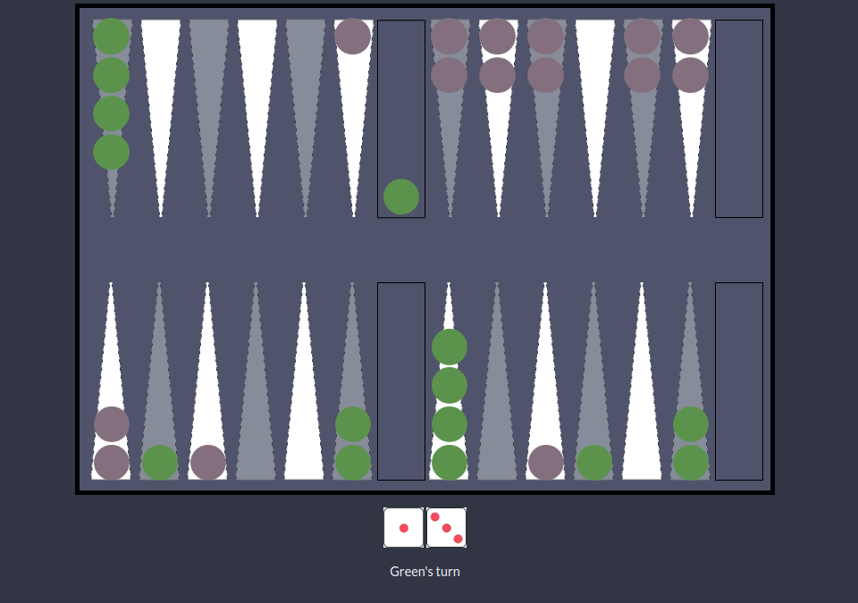

# backgammon

https://back-gammon.herokuapp.com

A backgammon game



To run locally:

```$ git clone https://github.com/rileythomp/backgammon.git```

```$ cd backgammon```

```$ npm i```

```$ npm start```

Then go to localhost:3000 in your browser
